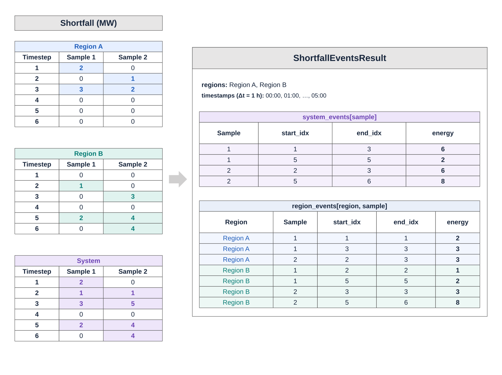

# [Result Specifications](@id results)

Different analyses require different kinds of results, and different levels of
detail within those results. PRAS considers many operational decisions and
system states internally, not all of which are relevant outputs for every analysis. When a user invokes
PRAS' `assess` function, one or more "result specifications" must be provided in order to indicate
the simulation outcomes that are of interest, and the desired level of
sample aggregation or unit type (if applicable) for which those
results should be reported. In general, sample-level disaggregation
should be used with care, as this can require large amounts of memory if
simulating with many samples.

The current version of PRAS includes six built-in result specification
families, with additional user-defined specifications possible (see 
[Custom Result Specifications](@ref customsimspec)). These families can be classified into regional
results (**Shortfall** and **Surplus**), interface results
(**Flow** and **Utilization**), and unit results
(**Availability** and **Energy**).

When invoking `assess` in Julia, result specifications are provided as
the final arguments to the function call, and a tuple of results are returned
in that same order. (Note that a tuple is *always* returned, even if a
single result specification is requested.) An example of requesting three
result specifications is:

```julia
surplus, flow, genavail = assess(
    sys, SequentialMonteCarlo(), Surplus(), Flow(), GeneratorAvailability())
```

Depending on the result specification, a result object may support indexing
into it to obtain results for a specific time period, region, interface, or
unit. For example, using the results returned above:

```julia
timestamp = ZonedDateTime(2020, 1, 1, 13, tz"UTC")
genname = "Generator 1"
regionname = "Region A"
interface = "Region A" => "Region B"

# get the sample mean and standard deviation of observed total system
# surplus capacity at 1pm UTC on January 1, 2020:
m, sd = surplus[timestamp]

# get the sample mean and standard deviation of observed surplus capacity
# in Region A at 1pm UTC on January 1, 2020:
m, sd = surplus[regionname, timestamp]

# get the sample mean and standard deviation of average interface flow
# between Region A and Region B:
m, sd = flow[interface]

# get the sample mean and standard deviation of interface flow
# between Region A and Region B at 1pm UTC on January 1, 2020:
m, sd = flow[interface, timestamp]

# get the vector of random generator availability states in every sample
# for Generator 1, at 1pm UTC on January 1, 2020:
states = genavail[genname, timestamp]
```

Results can be reported in different ways depending on the result
specification being used, and not all types of indexing are appropriate for
every result specification. For example, it would not make sense to aggregate
interface flows across all interfaces in the system, or surplus power
(potentially from energy-limited devices) across all time periods.

The remainder of this chapter provides additional
details about the six built-in result specification families in PRAS.

## Regional Results

The Shortfall and Surplus result families are defined over regions, and their
result objects can all be indexed into by region name. The table below outlines the simulation specifications that members of
these families are compatible with, as well as the levels of disaggregation
they support.

| Result Specification               | Units | SMC | Sample | Region | Timestep | Region + Timestep |
|------------------------------------|-------|-----|--------|--------|---------|------------------|
| `Shortfall`                        | Energy | •   |        | •      | •       | •               |
| `ShortfallSamples`                 | Energy | •   | •      | •      | •       | •               |
| `ShortfallEvents`                  | [See below](@ref shortfall_events) | • | • | • | | |
| `DemandResponseShortfall`          | Energy | •   |        | •      | •       | •               |
| `DemandResponseShortfallSamples`   | Energy | •   | •      | •      | •       | •               |
| `Surplus`                          | Power  | •   |        |        | •       | •               |
| `SurplusSamples`                   | Power  | •   | •      |        | •       | •               |

*Table: Regional result specification characteristics.*

### Shortfall

The Shortfall family of result specifications reports on unserved energy occurring during simulations.
As quantifying unserved energy is the core aspect of resource adequacy analysis, in practice almost every assessment requests a Shortfall-related result.
The basic `Shortfall` specification reports average shortfall results while `ShortfallSamples` provides results for individual simulation samples and timesteps.

If the system includes demand response units, demand response specific shortfall results
can also be queried: (`DemandResponseShortfall` and `DemandResponseShortfallSamples`).

Both demand response shortfall specifications provide the same accessor functions 
as the system shortfall objects, but only record borrowed load from demand response 
units that was unable to be repaid and is therefore classified as unserved energy. 
Note that the system shortfall object is inclusive of any attributable demand response shortfall, 
and therefore the two should never be added together. Similar period and region 
specific metrics can be obtained to the metrics mentioned below in the system shortfall object.

`Shortfall` and `ShortfallSamples` result objects can be indexed into by region, timestep, both region and timestep or neither.
Indexing on neither (via `result[]`) reports the total shortfall across all regions and time periods.

`Shortfall` and `ShortfallSamples` results can also be converted to probabilistic risk metrics such as **EUE**, **LOLE** or **CVAR**.
For sampling-based methods, both metric estimates and their standard errors are provided.
For example, metrics across all regions and the full simulation horizon can be extracted as:

```julia
shortfall, = assess(sys, SequentialMonteCarlo(), Shortfall())
eue_overall = EUE(shortfall)
lole_overall = LOLE(shortfall)
ue_cvar_overall = CVAR(:energy, shortfall, 0.95)
```

More specific metrics can be obtained as well:

```julia
region = "Region A"
period = ZonedDateTime(2020, 1, 1, 0, tz"America/Denver")

eue_period = EUE(shortfall, period)
lole_region = LOLE(shortfall, region)
eue_region_period = EUE(shortfall, region, period)
```

#### [Shortfall Events](@id shortfall_events)

`ShortfallEvents` records each contiguous run of simulation timesteps with positive shortfall as a separate event.
Events are identified independently within each Monte Carlo sample at both system and regional levels.
A timestep without shortfall ends an event; crossing midnight does not.
Events still active at the end of a sample are closed at its final timestep and never continue into another sample.

Unlike `ShortfallResult`, `ShortfallEventsResult` retains individual event timing and energy.
It records events directly instead of requiring postprocessing of the full `ShortfallSamplesResult` array, reducing storage when events are sparse.



*Illustrative shortfall values and their corresponding internal event records; events are recorded directly during simulation without first storing the displayed time series.*

System events remain continuous while any region has shortfall, even if the affected region changes.
In sample 1, timesteps 1–3 therefore form one system event despite Region A having two separate events; system event counts are not sums of regional event counts.

##### Requesting and Accessing Events

```julia
events, = assess(sys, SequentialMonteCarlo(samples=1000), ShortfallEvents())
region = first(sys.regions.names)

system_events = events[1]          # System events in sample 1
regional_events = events[region, 1] # Regional events in sample 1
events_by_sample = events[region]  # Regional event lists for every sample
```

Samples without events have empty event lists.
Unlike `ShortfallSamplesResult`, this result does not support timestep indexing or contain the within-event shortfall profile or peak shortfall.
Each event has `start_idx`, `end_idx` and `energy` fields.

```julia
if !isempty(system_events)
    event = first(system_events)
    start_timestamp = events.timestamps[event.start_idx]
    last_timestamp = events.timestamps[event.end_idx]
    duration_periods = event.end_idx - event.start_idx + 1
    duration = duration_periods * step(events.timestamps)
end
```

Both boundary indices are inclusive.
`last_timestamp` labels the final timestep included in the event; it is not the timestamp of the following timestep.
For example, an event covering three 15-minute timesteps lasts 45 minutes.

##### Event Metrics and Units

```julia
lolev = LOLEv(events)
mean_duration = MeanEventDuration(events)
max_duration = MaxEventDuration(events)
mean_energy = MeanEventEnergy(events)
max_energy = MaxEventEnergy(events)

regional_lolev = LOLEv(events, region)
regional_mean_energy = MeanEventEnergy(events, region)
```

All five metrics support either the whole system or a region name.
`LOLEv` averages event counts across samples, including samples with no events.
The mean duration and energy metrics pool all observed events; the maximum metrics report the largest observed event rather than an average of per-sample maxima.
See [Multi-Metric Resource Adequacy Analyses with PRAS](@ref multi_metric_resource_adequacy) for their interpretation.

If no events are observed, all five event metrics return zero with zero standard error.
The maximum metrics also report zero standard error because they return observed maxima, not estimates of an expected maximum.

Duration metric values count simulation timesteps and their display identifies the timestep length and unit.
Energy metrics use the system's configured energy unit, such as MWh or kWh.
The internal `event.energy` field is an unconverted sum of shortfall power values, so it must not be interpreted directly as energy in that unit.
For example, 10 MW of shortfall over two 15-minute timesteps gives an internal sum of 20 and an event energy of 5 MWh after conversion.

For JSON output, see [Exporting shortfall events](@ref exporting_shortfall_events).

### Surplus
The Surplus family of result specifications (`Surplus` and
`SurplusSamples`) reports on excess grid injection capacity (via
generation or discharging) in the system. This can be used to study
"near misses" where shortfall came close to occuring but did not actually
happen. The `Surplus` specification reports average surplus across
samples, while `SurplusSamples` reports simulation-level observations.

Surplus capacity is reported in terms of power, and so results are always
disaggregated by timestep (indexed either by timestep or both region and
timestep).

## Interface Results

The Flow and Utilization families of result specifications are defined over
interfaces, and their result objects can all be indexed into by a pair of
region names (indicating the source and destination regions for power
transfer). The table below outlines the simulation specifications
that members of these families are compatible with, as well as the levels of
disaggregation they support.

| Result Specification | Units | SMC | Sample | Interface | Timestep | Interface + Timestep |
|----------------------|-------|-----|--------|-----------|---------|---------------------|
| `Flow`               | Power | •   |        | •         |         | •                   |
| `FlowSamples`        | Power | •   | •      | •         |         | •                   |
| `Utilization`        | --    | •   |        | •         |         | •                   |
| `UtilizationSamples` | --    | •   | •      | •         |         | •                   |

*Table: Interface result specification characteristics.*

### Flow

The Flow family of result specifications (`Flow` and
`FlowSamples`) reports the direction and magnitude of power transfer
on an interface. This can be used to study which regions are importers vs
exporters of energy, either on average or at specific periods in time. The
`Flow` specification reports average flow across all samples, while
`FlowSamples` reports simulation-level observations. Flow results are
directional, so the order in which the regions are provided when looking up
a result will determine the result's sign. For example:

```julia
m1, sd1 = flow["Region A" => "Region B"]
m2, sd2 = flow["Region B" => "Region A"]

m1 == -m2 # true
sd1 == sd2 # true
```

Flow values are reported in terms of power, and results are always
disaggregated by interface. Results that aggregate over time report the average
flow over the time span.
 
### Utilization

The Utilization family of result specifications (`Utilization` and
`UtilizationSamples`) is similar to the Flow
family, but reports the fraction of an interface's
available transfer capacity that is used in the direction of flow, instead of
the flow power itself. Results can therefore range between 0 and 1.
This metric can be useful for studying the impact of line outages and
transmission congestion on unserved energy.
The `Utilization` specification reports average flow across all samples,
while `UtilizationSamples` reports simulation-level observations. Unlike
Flow, Utilization results are not directional and so will report the same
utilization regardless of the flow direction implied by the order of the
provided regions:

```julia
util, = assess(sys, SequentialMonteCarlo(), Utilization())
util["Region A" => "Region B"] == util["Region B" => "Region A"]
```

Utilization values are unitless, and results are always
disaggregated by interface. Results that aggregate over time report the average
utilization over the time span.

## Unit Results

The Availability and Energy families of result specifications are defined over
individual units, and their result objects can all be indexed into by a unit
name and timestep. The table below outlines the simulation
specifications that members of these families are compatible with, as well as
the levels of disaggregation they support.

| Result Specification | Units | SMC | Sample | Unit | Timestep | Unit + Timestep |
|----------------------|-------|-----|--------|------|---------|----------------|
| `GeneratorAvailability` | -- | •   | •      |      |         | •              |
| `StorageAvailability` | -- | •   | •      |      |         | •              |
| `GeneratorStorageAvailability` | -- | •   | •      |      |         | •              |
| `DemandResponseAvailability` | -- | •   | •      |      |         | •              |
| `LineAvailability` | -- | •   | •      |      |         | •              |
| `StorageEnergy` | Energy | •   |        |      | •       | •              |
| `StorageEnergySamples` | Energy | •   | •      |      | •       | •              |
| `GeneratorStorageEnergy` | Energy | •   |        |      | •       | •              |
| `GeneratorStorageEnergySamples` | Energy | •   | •      |      | •       | •              |
| `DemandResponseEnergy` | Energy | •   |        |      | •       | •              |
| `DemandResponseEnergySamples` | Energy | •   | •      |      | •       | •              |

*Table: Unit result specification characteristics.*

### Availability

The Availability family of result specifications
(`GeneratorAvailability`, `StorageAvailability`,
`GeneratorStorageAvailability`, `DemandResponseAvailability`, and `LineAvailability`) reports the availability state
(available, or unavailable due to an unplanned outage) of individual units in
the simulation. The five result specification variants correspond to the five
categories of resources: generators, storages, generator-storages, demand responses, and
lines. Availability is reported as a boolean value (with `true`
indicating the unit is available, and `false` indicating it isn't), and
is always disaggregated by unit, timestep, and sample.

### Energy

The Energy family of result specifications (`StorageEnergy`,
`StorageEnergySamples`, `GeneratorStorageEnergy`,
`GeneratorStorageEnergySamples`, `DemandResponseEnergy`, and 
`DemandResponseEnergySamples`)  reports the energy state-of-charge or 
borrowed load associated with individual energy-limited resources. Result specification
variants are available for selecting the category of energy-limited resource
(storage, generator-storage, or demand response) to report, as well as for requesting
sample-level disaggregation. Energy is always disaggregated by timestep and
may also be disaggregated by unit (get the state of charge or borrowed load of a single
unit) or aggregated across the system (get the sum of states of charge or borrowed loads
of all component devices in the system).
